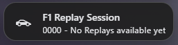
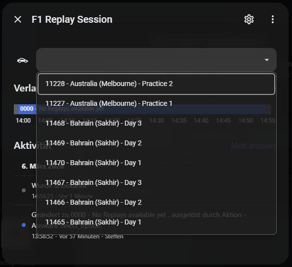

# 🏎️ F1 Reaction Service

A lightweight, fully dockerized .NET 10 background worker that brings the thrill of Formula 1 directly into your Smart Home. 

This service acts as a bridge between the [OpenF1 API](https://openf1.org/) and your MQTT broker. It monitors race sessions and publishes real-time (or perfectly timed historical) events—such as Track Status (Red Flags, Safety Cars) and Leader Changes (P1)—so your Home Assistant can trigger spectacular lighting and automation effects.

---

## 💡 Inspiration & Credits
A huge shoutout goes to [Moeren588's Dashboard-Reaction-Service](https://github.com/Moeren588/Dashboard-Reaction-Service). This project was heavily inspired by their awesome work and takes the core idea to the next level by introducing a dual-tier architecture (Live MQTT vs. Offline Smart Sync), a zero-maintenance setup, and full test coverage.

## ✨ Features
* **Dual-Tier Data Engine (Free & Paid):** * *Paid Tier:* Connects directly to the OpenF1 MQTT broker for absolute zero-latency live telemetry.
  * *Free Tier:* Automatically falls back to a smart REST-API sync, downloading completed sessions for perfectly timed offline replays.
* **Smart Sync & Self-Healing:** The service automatically builds and maintains a local SQLite database of all historical sessions. Missing a race? It syncs the delta automatically in the background.
* **Zero-Config Home Assistant Integration:** Replays are automatically published to Home Assistant via MQTT Discovery. No YAML configuration required for the UI dropdown!
* **Real-Time Flag Alerts:** Instantly detects Green, Yellow, Red, SC, and VSC flags and pushes them via MQTT.
* **Live P1 Tracking:** Monitors who is currently leading the race (or setting the fastest lap).
* **Zero-Maintenance Driver Grid:** Automatically fetches the current driver lineup and official team colors directly from the OpenF1 API at the start of every session.
* **Hollywood Demo Mode:** Includes a built-in simulation sequence to easily test your Home Assistant automations without having to wait for Sunday.
* **Clean Architecture:** Fully tested codebase separating the API muscle from the business logic brain.

## 🚀 Quick Start (Docker Compose)

The easiest way to run the F1 Reaction Service is via Docker Compose. Because of the host-mode networking, the container can easily reach your local MQTT broker without complicated port mappings.

```yaml
services:
  f1-reaction-service:
    image: ghcr.io/staglech/f1-reaction-service:latest
    container_name: f1-reaction-service
    restart: unless-stopped
    network_mode: "host"
    volumes:
      - ./data:/app/data
    environment:
      - MQTT_HOST=127.0.0.1
      - MQTT_PORT=1883
      - MQTT_USER=your_mqtt_user
      - MQTT_PASSWORD=your_mqtt_password
      # Optional: Add OpenF1 credentials to unlock Live MQTT Streaming (Paid Tier)
      # If left blank, the service runs in Free Tier (Historical Replays only)
      # - OPENF1_USERNAME=your_email@domain.com
      # - OPENF1_PASSWORD=your_token
```

## 📡 MQTT Interface

### 📥 Inbound Commands (Controlling the Service)
Send a message to the `f1/service/command` topic to control the service's behavior:

* `START` - Wakes up the service and connects to the live stream (if credentials are provided).
* `STOP` - Puts the service back into standby mode and halts any running replays.
* `CALIBRATE_START` - Triggers a manual calibration/refresh of the current session data. Useful to sync the TV broadcast delay with the API data.
* `CALIBRATE_ADJUST_<number>` - Adjusts the delay in ms. The number can be positive or negative (1000 or -1000).
* `DEMO_START` - Fires up the built-in Hollywood Demo Mode to test your smart home lighting.
* `TRACK_ADD_<driver_number>` - Adds a driver to the tracked drivers list (e.g., `TRACK_ADD_44`).
* `TRACK_REMOVE_<driver_number>` - Removes a driver from the tracked drivers list. 
* `TRACK_CLEAR` - Clears the tracked drivers list. 
* `REPLAY_START_<session_id>` - Wakes up the background worker and streams a recorded session from the local SQLite DB with original timing.

### 📤 Outbound Events (Home Assistant Triggers)
The service publishes lightweight JSON payloads when important events happen on track.

**1. Track Status / Flags (`f1/track_status`)**
Fired whenever the track condition changes.
```json
{
  "flag": "RED",
  "message": "Session Suspended"
}
```

**2. Leader Change (`f1/position`)**
Fired whenever a new driver takes P1.
```json
{
  "driver": "Lando Norris",
  "driver_number": 1,
  "short_name": "NOR",
  "team": "McLaren",
  "color": "#FF8000",
  "reason": "Race Leader",
  "session": "Race",
  "is_live": true
}
```

**3. Weather Events (`f1/weather`)**
```json
{
  "raining": true,
  "rainfall_value": 1.5
}
```

---

## 🏡 Home Assistant Integration Guide

To make the integration as seamless as possible, here are fully working YAML examples using the modern Home Assistant syntax.

### 1. Controlling the Service (Script)
Create this script to easily send commands from a Home Assistant dashboard button.

```yaml
f1_service_control:
  alias: "F1 Service Control"
  description: "Send commands to the F1 Reaction Service"
  icon: mdi:racing-helmet
  mode: single
  fields:
    command:
      name: Command
      description: "Available commands: START, STOP, CALIBRATE_START, DEMO_START"
      required: true
      example: "START"
  sequence:
    - action: mqtt.publish
      data:
        topic: "f1/service/command"
        payload: "{{ command }}"
```

#### Calendar Automation Example
This automation will automatically start the service when an F1 calendar event occurs.

```yaml
alias: "F1: Reaction Service control"
description: Starts the F1 reaction service based on F1 calendar events
triggers:
  - event: start
    entity_id: calendar.formula_1
    id: f1_start
    trigger: calendar
  - event: end
    entity_id: calendar.formula_1
    id: f1_end
    trigger: calendar
actions:
  - choose:
      - conditions:
          - condition: trigger
            id: f1_start
        sequence:
          - action: mqtt.publish
            data:
              topic: f1/service/command
              payload: START
          - action: notify.notify
            data:
              message: "🏎️ F1 service started: {{ trigger.calendar_event.summary }}"
      - conditions:
          - condition: trigger
            id: f1_end
        sequence:
          - action: mqtt.publish
            data:
              topic: f1/service/command
              payload: STOP
          - action: notify.notify
            data:
              message: "🏁 F1 Service beendet."
mode: single
```

### 2. The Red Flag Alert (Automation & Light Effect)
This automation listens to the MQTT topic. When a Red Flag is detected, it temporarily saves your current light settings, flashes the lights red for 10 seconds, and then restores them.

```yaml
automation:
  - alias: "F1: Red Flag Alert"
    trigger:
      - trigger: mqtt
        topic: f1/track_status
    condition:
      - condition: template
        value_template: "{{ trigger.payload_json.flag == 'RED' }}"
    action:
      # 1. Save the current state of your lights
      - action: scene.create
        data:
          scene_id: before_red_flag
          snapshot_entities:
            - light.living_room_lights

      # 2. Turn the lights bright RED
      - action: light.turn_on
        target:
          entity_id: light.living_room_lights
        data:
          color_name: red
          brightness_pct: 100

      # 3. Wait for 10 seconds to show the alert
      - delay:
          seconds: 10

      # 4. Restore the lights to how they were before
      - action: scene.turn_on
        target:
          entity_id: scene.before_red_flag
    mode: restart
```

### 3. Light control Flags and P1 change
This automation is my main automation which will control my lights and will react to flags, SC and P1 changes.

```yaml
alias: F1 Race Lighting Control
description: Controls Hue lights based on F1 race status
triggers:
  - trigger: mqtt
    id: flag_update
    topic: f1/race/flag_status
  - trigger: mqtt
    id: leader_update
    topic: f1/race/p1
conditions:
  - condition: state
    entity_id: input_boolean.f1_mode
    state: "on"
actions:
  - choose:
      - conditions:
          - condition: trigger
            id: flag_update
        sequence:
          - choose:
              - conditions:
                  - condition: template
                    value_template: "{{ trigger.payload_json.flag == 'RED' }}"
                sequence:
                  - action: script.f1_red_flag
              - conditions:
                  - condition: template
                    value_template: >-
                      {{ trigger.payload_json.flag in ['SAFETY CAR', 'SC',
                      'VSC'] }}
                sequence:
                  - action: script.f1_safety_car
              - conditions:
                  - condition: template
                    value_template: >-
                      {{ trigger.payload_json.flag in ['YELLOW', 'DOUBLE
                      YELLOW'] }}
                sequence:
                  - action: script.f1_yellow_flag
      - conditions:
          - condition: trigger
            id: leader_update
        sequence:
          - action: light.turn_on
            target:
              entity_id:
                - light.living_room_lights
                - light.hue_spot
            data:
              brightness_pct: 100
              rgb_color: >
                 [{{ hex[1:3] |
                int(base=16) }}, {{ hex[3:5] | int(base=16) }}, {{ hex[5:7] |
                int(base=16) }}]
mode: restart

```

### 3. Replay Mode (Zero-Config)
Thanks to MQTT Discovery, the service will automatically create an entity in your Home Assistant for the available replays! 

Simply search for the `select.f1_replay_session` entity and add it to your dashboard. Selecting an option will automatically wake the service and stream the recorded MQTT events in the exact order with the original timing. Perfect for syncing your smart lights while watching a replay on TV.




## 🛠️ Development & Testing
This project embraces clean architecture and uses `xUnit` alongside `FluentAssertions` and `NSubstitute` for unit testing. 
To run the tests locally:
```bash
dotnet test
```